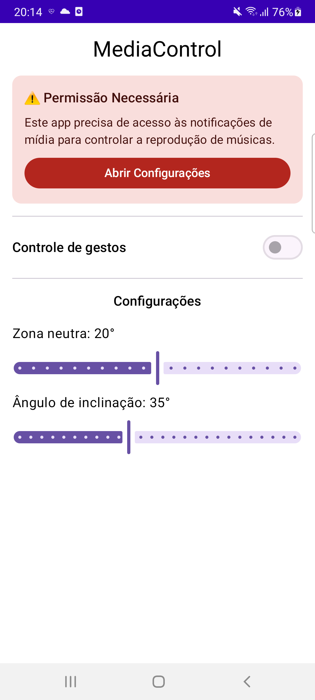
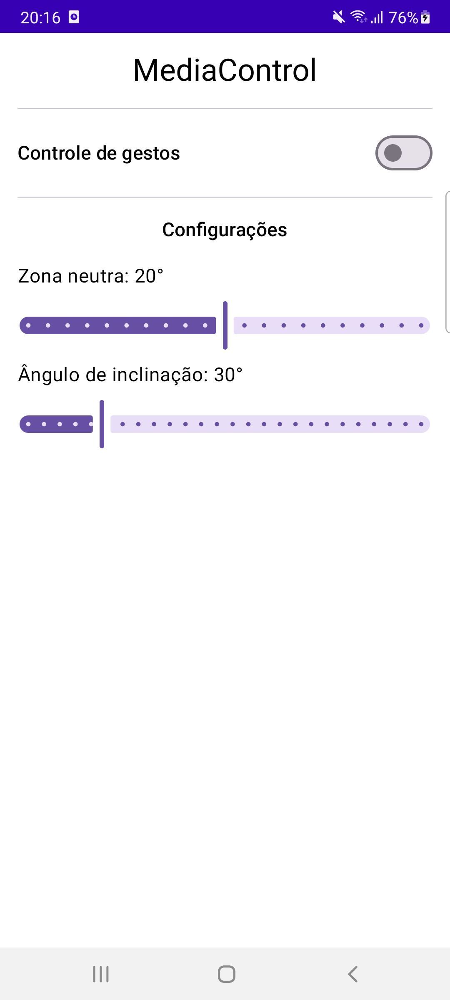
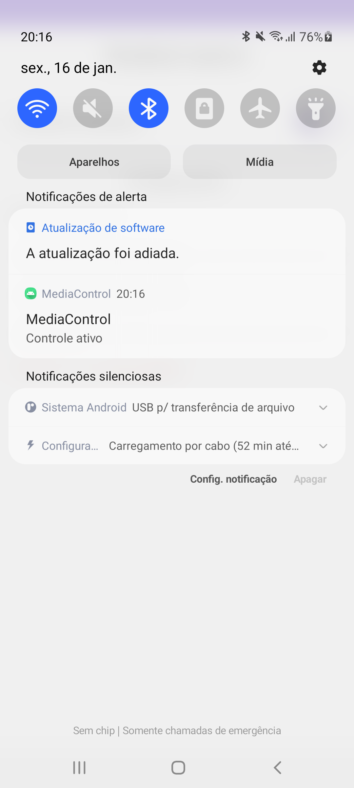

# Media Control por Gestos
Repositório: https://github.com/LucasSLopes/SensorMediaControl.git

Aplicativo Android desenvolvido em Kotlin com Jetpack Compose que permite controlar a reprodução de mídia (música, podcasts, etc.) através de gestos de inclinação do dispositivo, eliminando a necessidade de interação com a tela.

## Visão Geral
- Controle de mídia hands-free usando o **acelerômetro** do Android através do framework de sensores.
- Detecta inclinação lateral do dispositivo para pular músicas (direita = próxima, esquerda = anterior).
- Motor de gestos com **máquina de estados** que garante detecção precisa e evita comandos acidentais.
- Serviço em foreground que mantém o monitoramento de sensores mesmo com a tela desligada.
- Interface minimalista com configurações ajustáveis para personalizar sensibilidade dos gestos.

## Funcionalidades
- **Controle por Gestos**: Incline o dispositivo para a direita/esquerda para avançar/voltar músicas
- **Detecção Inteligente**: Algoritmo de duplo estágio (inclinação → retorno ao neutro) previne comandos não intencionais
- **Configuração de Sensibilidade**: Ajuste a zona neutra (10-30°) e ângulo de inclinação necessário (25-50°)
- **Monitoramento em Background**: Serviço foreground com notificação persistente mantém funcionalidade ativa
- **Compatibilidade Universal**: Funciona com qualquer app de áudio que implemente `MediaSession` (Spotify, YouTube Music, etc.)

## Demonstração em Vídeo
[▶️ Assista à demonstração](https://drive.google.com/file/d/1hD5gW8yzcP9tIYEn40V31Y_JQomDHOAy/view?usp=sharing)

## Pré-visualizações

### Tela Inicial - Solicitação de Permissão


### Tela Principal


### Notificação do Serviço Ativo



## Arquitetura do Sistema de Gestos

### 1. Framework de Sensores Android

O app utiliza o **SensorManager** do Android para acessar o acelerômetro do dispositivo em tempo real:

```kotlin
class GestureForegroundService : Service(), SensorEventListener {
    private lateinit var sensorManager: SensorManager
    private lateinit var accelerometer: Sensor
    
    override fun onCreate() {
        super.onCreate()
        sensorManager = getSystemService(SENSOR_SERVICE) as SensorManager
        accelerometer = sensorManager.getDefaultSensor(Sensor.TYPE_ACCELEROMETER)
            ?: throw IllegalStateException("Dispositivo sem acelerômetro")
    }
    
    private fun startSensorListening() {
        sensorManager.registerListener(
            this,
            accelerometer,
            SensorManager.SENSOR_DELAY_GAME // ~20ms de latência
        )
    }
    
    override fun onSensorChanged(event: SensorEvent) {
        if (event.sensor.type == Sensor.TYPE_ACCELEROMETER) {
            val (x, y, z) = event.values
            processAccelerometerData(x, y, z)
        }
    }
}
```

**Cálculo do Ângulo de Inclinação:**

O acelerômetro fornece três componentes de aceleração (X, Y, Z) em m/s². Para detectar inclinação lateral (roll), calculamos:

```kotlin
private fun processAccelerometerData(x: Float, y: Float, z: Float) {
    // Calcula ângulo de rotação no eixo longitudinal do dispositivo
    val rollRad = atan2(y.toDouble(), z.toDouble())
    val rollDeg = Math.toDegrees(rollRad).toFloat()
    
    // Alimenta motor de gestos com o ângulo calculado
    val command = gestureEngine.onRoll(rollDeg)
    command?.let { executeMediaCommand(it) }
}
```

**Interpretação Física:**
- **Y positivo**: Dispositivo inclinado para direita
- **Y negativo**: Dispositivo inclinado para esquerda
- **Z dominante**: Dispositivo na posição neutra (deitado ou em pé)
- A razão `atan2(Y, Z)` converte vetores de gravidade em ângulo de inclinação

**Configuração de Taxa de Atualização:**
- `SENSOR_DELAY_GAME` (~20ms): Balanceia responsividade e consumo de bateria
- Alternativas disponíveis:
  - `SENSOR_DELAY_FASTEST` (~0ms): Máxima taxa, alto consumo
  - `SENSOR_DELAY_UI` (~67ms): Para animações UI
  - `SENSOR_DELAY_NORMAL` (~200ms): Economia de bateria

### 2. Motor de Detecção de Gestos (`GestureEngine`)

Uma **máquina de estados finitos** que processa dados brutos do sensor e os converte em comandos de mídia:

```kotlin
class GestureEngine(val config: Config = Config()) {
    data class Config(
        val tiltThresholdDeg: Float = 35f,
        val neutralThresholdDeg: Float = 20f,
        val debounceMs: Long = 800
    )
    
    enum class Command { SKIP_NEXT, SKIP_PREVIOUS }
    
    private enum class TiltState { IDLE, TILTED }
    private enum class Side { LEFT, RIGHT, NEUTRAL }
    
    private var tiltState = TiltState.IDLE
    private var tiltingSide: Side? = null
    private var lastCommandTime = 0L
    
    fun onRoll(rollDeg: Float): Command? {
        val currentSide = classifySide(rollDeg)
        
        return when (tiltState) {
            TiltState.IDLE -> {
                if (currentSide != Side.NEUTRAL) {
                    tiltingSide = currentSide
                    tiltState = TiltState.TILTED
                }
                null
            }
            TiltState.TILTED -> {
                if (currentSide == Side.NEUTRAL && canEmitCommand()) {
                    val cmd = when (tiltingSide) {
                        Side.RIGHT -> Command.SKIP_NEXT
                        Side.LEFT -> Command.SKIP_PREVIOUS
                        else -> null
                    }
                    reset()
                    cmd
                } else null
            }
        }
    }
    
    private fun classifySide(rollDeg: Float): Side = when {
        rollDeg > config.tiltThresholdDeg -> Side.RIGHT
        rollDeg < -config.tiltThresholdDeg -> Side.LEFT
        abs(rollDeg) < config.neutralThresholdDeg -> Side.NEUTRAL
        else -> tiltingSide ?: Side.NEUTRAL
    }
    
    private fun canEmitCommand(): Boolean {
        val now = System.currentTimeMillis()
        return (now - lastCommandTime) >= config.debounceMs
    }
    
    private fun reset() {
        tiltState = TiltState.IDLE
        tiltingSide = null
        lastCommandTime = System.currentTimeMillis()
    }
}
```

**Fluxo de Detecção (Diagrama de Estados):**

```
[IDLE] ---(rollDeg > 35°)---> [TILTED (RIGHT)]
                                      |
                              (rollDeg < 20°)
                                      ↓
                            [Emite SKIP_NEXT] → [IDLE + Debounce 800ms]


[IDLE] ---(rollDeg < -35°)---> [TILTED (LEFT)]
                                       |
                               (rollDeg > -20°)
                                       ↓
                            [Emite SKIP_PREVIOUS] → [IDLE + Debounce 800ms]
```

**Benefícios da Abordagem:**
- ✅ **Zero falsos positivos**: Requer movimento completo (inclinação → neutralização)
- ✅ **Controle fino**: Thresholds separados evitam oscilação (hysteresis)
- ✅ **Debounce inteligente**: Previne comandos repetidos acidentais durante movimento contínuo
- ✅ **Configurável**: Usuário ajusta sensibilidade via sliders na UI

### 3. Serviço Foreground com Sensores

Implementa `Service` + `SensorEventListener` para manter monitoramento ativo mesmo com tela desligada:

```kotlin
class GestureForegroundService : Service(), SensorEventListener {
    companion object {
        const val ACTION_START = "START_GESTURE_SERVICE"
        const val ACTION_STOP = "STOP_GESTURE_SERVICE"
        const val NOTIFICATION_ID = 1001
    }
    
    private lateinit var gestureEngine: GestureEngine
    
    override fun onStartCommand(intent: Intent?, flags: Int, startId: Int): Int {
        when (intent?.action) {
            ACTION_START -> {
                val neutralZone = intent.getFloatExtra("neutralZoneDeg", 20f)
                val tiltThreshold = intent.getFloatExtra("tiltThresholdDeg", 35f)
                
                gestureEngine = GestureEngine(
                    GestureEngine.Config(
                        tiltThresholdDeg = tiltThreshold,
                        neutralThresholdDeg = neutralZone
                    )
                )
                
                createNotificationChannel()
                startForeground(NOTIFICATION_ID, buildNotification())
                startSensorListening()
            }
            ACTION_STOP -> {
                stopSensorListening()
                stopForeground(STOP_FOREGROUND_REMOVE)
                stopSelf()
            }
        }
        return START_STICKY
    }
    
    private fun buildNotification(): Notification {
        return NotificationCompat.Builder(this, CHANNEL_ID)
            .setContentTitle("Controle de Gestos Ativo")
            .setContentText("Incline o dispositivo para controlar músicas")
            .setSmallIcon(R.drawable.ic_gesture)
            .setPriority(NotificationCompat.PRIORITY_LOW)
            .build()
    }
    
    override fun onDestroy() {
        stopSensorListening()
        super.onDestroy()
    }
    
    private fun stopSensorListening() {
        sensorManager.unregisterListener(this)
    }
}
```

**Por que Foreground Service?**
- Android mata serviços background para economizar bateria
- Serviço foreground requer notificação, mas garante execução contínua
- Essencial para monitorar sensores com tela desligada

### 4. Controle de Mídia via MediaSession API

Interage com apps de áudio através do `MediaController` fornecido por `NotificationListenerService`:

```kotlin
object MediaCommander {
    fun skipNext(): Boolean {
        val controller = MediaNotificationListener.getController() 
            ?: return false
        controller.transportControls.skipToNext()
        return true
    }
    
    fun skipPrevious(): Boolean {
        val controller = MediaNotificationListener.getController()
            ?: return false
        controller.transportControls.skipToPrevious()
        return true
    }
}

class MediaNotificationListener : NotificationListenerService() {
    companion object {
        private var mediaController: MediaController? = null
        
        fun getController() = mediaController
        
        fun isPermissionGranted(context: Context): Boolean {
            val packageName = context.packageName
            val listeners = Settings.Secure.getString(
                context.contentResolver,
                "enabled_notification_listeners"
            )
            return listeners?.contains(packageName) == true
        }
    }
    
    override fun onListenerConnected() {
        val sessions = (getSystemService(MEDIA_SESSION_SERVICE) as MediaSessionManager)
            .getActiveSessions(ComponentName(this, MediaNotificationListener::class.java))
        updateController(sessions)
    }
    
    private fun updateController(sessions: List<MediaController>) {
        mediaController = sessions.firstOrNull { 
            it.playbackState?.state == PlaybackState.STATE_PLAYING 
        } ?: sessions.lastOrNull()
    }
}
```

**Funcionamento:**
1. `NotificationListenerService` intercepta sessões de mídia ativas do sistema
2. Identifica o player em reprodução (`STATE_PLAYING`)
3. `MediaCommander` envia comandos via `TransportControls`
4. Apps compatíveis (Spotify, YouTube Music, etc.) respondem aos comandos

### 5. Interface Compose com Configurações

UI minimalista com controles para ativar serviço e ajustar sensibilidade:

```kotlin
@Composable
fun MainScreen(
    hasNotificationListenerAccess: Boolean,
    onOpenListenerSettings: () -> Unit
) {
    var isServiceActive by remember { mutableStateOf(false) }
    var neutralZone by remember { mutableStateOf(20f) }
    var tiltThreshold by remember { mutableStateOf(35f) }
    
    Column(modifier = Modifier.padding(16.dp)) {
        Text(
            text = "MediaControl",
            style = MaterialTheme.typography.headlineMedium
        )
        
        if (!hasNotificationListenerAccess) {
            Card(colors = CardDefaults.cardColors(
                containerColor = MaterialTheme.colorScheme.errorContainer
            )) {
                Column(modifier = Modifier.padding(16.dp)) {
                    Text("⚠️ Permissão Necessária")
                    Text("Este app precisa de acesso às notificações de mídia")
                    Button(onClick = onOpenListenerSettings) {
                        Text("Abrir Configurações")
                    }
                }
            }
        }
        
        Row {
            Text("Controle de gestos")
            Switch(
                checked = isServiceActive,
                enabled = hasNotificationListenerAccess,
                onCheckedChange = { enable ->
                    if (enable) {
                        val intent = Intent(context, GestureForegroundService::class.java).apply {
                            action = GestureForegroundService.ACTION_START
                            putExtra("neutralZoneDeg", neutralZone)
                            putExtra("tiltThresholdDeg", tiltThreshold)
                        }
                        ContextCompat.startForegroundService(context, intent)
                        isServiceActive = true
                    } else {
                        val intent = Intent(context, GestureForegroundService::class.java).apply {
                            action = GestureForegroundService.ACTION_STOP
                        }
                        context.startService(intent)
                        isServiceActive = false
                    }
                }
            )
        }
        
        Text("Zona neutra: ${neutralZone.toInt()}°")
        Slider(
            value = neutralZone,
            onValueChange = { neutralZone = it },
            valueRange = 10f..30f,
            enabled = !isServiceActive
        )
        
        Text("Ângulo de inclinação: ${tiltThreshold.toInt()}°")
        Slider(
            value = tiltThreshold,
            onValueChange = { tiltThreshold = it },
            valueRange = 25f..50f,
            enabled = !isServiceActive
        )
    }
}
```

## Permissões Necessárias

O app requer três permissões críticas:

```xml
<!-- AndroidManifest.xml -->

<!-- Serviço em foreground (Android 9+) -->
<uses-permission android:name="android.permission.FOREGROUND_SERVICE" />
<uses-permission android:name="android.permission.FOREGROUND_SERVICE_SPECIAL_USE" />

<!-- Notificações (Android 13+) -->
<uses-permission android:name="android.permission.POST_NOTIFICATIONS" />

<!-- Leitura de notificações para acessar MediaSession -->
<uses-permission android:name="android.permission.BIND_NOTIFICATION_LISTENER_SERVICE"
    tools:ignore="ProtectedPermissions" />
```

**Fluxo de Permissões:**
1. **POST_NOTIFICATIONS**: Solicitada automaticamente ao iniciar o app (Android 13+)
2. **NOTIFICATION_LISTENER**: Usuário deve conceder manualmente em **Configurações → Notificações → Acesso às notificações**
3. App monitora constantemente o status e exibe alerta persistente até permissão ser concedida

## Stack e Ferramentas
- Kotlin 2.0.0
- Jetpack Compose (Material 3)
- Android Gradle Plugin 8.3.2
- Minimum SDK 24 | Target SDK 34
- **Sensores**: Acelerômetro (`TYPE_ACCELEROMETER`)
- **Mídia**: MediaSession API + NotificationListenerService

## Como Executar

### 1. Pré-requisitos
- Android Studio Hedgehog ou superior
- **Dispositivo físico com acelerômetro** (emuladores têm suporte limitado a sensores)
- JDK 17+

### 2. Instalação
```bash
git clone <repository-url>
cd SensorMediaControl
./gradlew assembleDebug
```

O APK gerado estará em `app/build/outputs/apk/debug/`.

### 3. Configuração de Permissões
Após instalar o APK:
1. Abra o app → conceda permissão de notificações (Android 13+)
2. Abra **Configurações** → **Notificações** → **Acesso às notificações**
3. Habilite o toggle para **Media Control**
4. Retorne ao app (alerta vermelho desaparecerá automaticamente)

### 4. Teste dos Gestos
1. Reproduza uma música em qualquer app (Spotify, YouTube Music, etc.)
2. No Media Control, ative o **switch "Controle de gestos"**
3. Incline o dispositivo ~45° para a direita → música avança
4. Incline ~45° para a esquerda → música volta
5. Ajuste a sensibilidade nos sliders se necessário

## Estrutura do Projeto
```
SensorMediaControl/
├── app/src/main/java/com/ufc/mediacontrol/
│   ├── MainActivity.kt                      # UI Compose + Lifecycle
│   ├── sensor/
│   │   └── GestureEngine.kt                # Máquina de estados de gestos
│   ├── service/
│   │   ├── GestureForegroundService.kt     # Serviço de sensores
│   │   └── MediaNotificationListener.kt     # Listener de sessões de mídia
│   └── media/
│       └── MediaCommander.kt               # API de comandos de mídia
├── app/src/main/res/
│   ├── values/strings.xml                   # Strings PT-BR
│   └── values-en/strings.xml                # Strings EN
└── previews/
    ├── Preview_APP_Permission_Alert.png
    ├── Preview_APP_Home.png
    └── Preview_APP_Notification.png
```

## Detalhes Técnicos

### Calibração de Sensores

O acelerômetro retorna valores em **m/s²** nos três eixos:
- **X**: Lateral (esquerda ↔ direita)
- **Y**: Longitudinal (frente ↔ trás)
- **Z**: Vertical (cima ↔ baixo)

**Conversão para Ângulo de Inclinação:**
```kotlin
// Componentes Y e Z representam projeção da gravidade no plano lateral
val rollRad = atan2(accelY, accelZ)
val rollDeg = Math.toDegrees(rollRad) // Converte radianos para graus

// Interpretação:
// rollDeg > 35°  → Direita (SKIP_NEXT)
// rollDeg < -35° → Esquerda (SKIP_PREVIOUS)
// -20° < rollDeg < 20° → Neutro (reset)
```

**Por que atan2(Y, Z) funciona?**
- Quando o dispositivo está deitado, Z ≈ 9.8 m/s² (gravidade total)
- Ao inclinar para direita, Y aumenta e Z diminui
- `atan2` calcula o ângulo resultante do vetor (Y, Z)

### Otimizações de Performance

**Gerenciamento de Sensores:**
```kotlin
// Registro apenas quando serviço está ativo
override fun onStartCommand(...) {
    sensorManager.registerListener(this, accelerometer, SENSOR_DELAY_GAME)
}

// Desregistro ao parar serviço
override fun onDestroy() {
    sensorManager.unregisterListener(this)
}
```

**Estratégias de Economia:**
- **SENSOR_DELAY_GAME** (~20ms): Balanceia responsividade (50 Hz) e bateria
- **Debounce de 800ms**: Ignora comandos durante período de cooldown
- **Máquina de estados**: Processa apenas transições relevantes (IDLE ↔ TILTED)
- **Desregistro automático**: Sensores são liberados quando serviço é destruído

**Consumo Típico:**
- ~0.5-1% de bateria por hora de uso contínuo
- Negligível em comparação com reprodução de música

### Compatibilidade

**Testado e funcional com:**
- ✅ Spotify
- ✅ YouTube Music
- ✅ Google Podcasts
- ✅ Players nativos do sistema

**Limitações conhecidas:**
- ❌ Apps que não implementam `MediaSession` (players web, alguns apps de terceiros)
- ⚠️ Requer dispositivo físico (emuladores têm sensores simulados imprecisos)
- ⚠️ Permissão de notificação deve ser concedida manualmente pelo usuário

## Avaliação (Critérios Acadêmicos)

### 1. Uso do Framework de Sensores (4 pt)

O app demonstra uso completo e correto do **SensorManager** do Android:

- **Registro adequado**: `registerListener()` com `SENSOR_DELAY_GAME` para balancear latência e consumo
- **Desregistro correto**: `unregisterListener()` no `onDestroy()` para liberar recursos
- **Processamento matemático**: Conversão de vetores de aceleração em ângulo de inclinação usando `atan2()`
- **Integração com serviço**: Sensores operando em foreground service para funcionalidade contínua

Trecho em `GestureForegroundService.kt`:
```kotlin
override fun onCreate() {
    sensorManager = getSystemService(SENSOR_SERVICE) as SensorManager
    accelerometer = sensorManager.getDefaultSensor(Sensor.TYPE_ACCELEROMETER)
}

private fun startSensorListening() {
    sensorManager.registerListener(this, accelerometer, SENSOR_DELAY_GAME)
}

override fun onSensorChanged(event: SensorEvent) {
    val (x, y, z) = event.values
    val rollDeg = Math.toDegrees(atan2(y.toDouble(), z.toDouble())).toFloat()
    gestureEngine.onRoll(rollDeg)?.let { executeMediaCommand(it) }
}

override fun onDestroy() {
    sensorManager.unregisterListener(this)
}
```

### 2. Algoritmo de Detecção de Gestos (3 pt)

Implementação de máquina de estados finitos que:

- **Evita falsos positivos**: Requer movimento completo (inclinação + neutralização)
- **Configurável**: Thresholds ajustáveis pelo usuário via UI
- **Debounce inteligente**: Previne comandos duplicados acidentais
- **Robusto**: Lida com transições de estado e hysteresis entre zonas

Principais funções em `GestureEngine.kt`:
```kotlin
fun onRoll(rollDeg: Float): Command? {
    val currentSide = classifySide(rollDeg)
    
    return when (tiltState) {
        TiltState.IDLE -> {
            if (currentSide != Side.NEUTRAL) {
                tiltingSide = currentSide
                tiltState = TiltState.TILTED
            }
            null
        }
        TiltState.TILTED -> {
            if (currentSide == Side.NEUTRAL && canEmitCommand()) {
                val cmd = tiltingSide.toCommand()
                reset()
                cmd
            } else null
        }
    }
}
```

### 3. Arquitetura e Boas Práticas (3 pt)

- **Separação de responsabilidades**: `GestureEngine`, `MediaCommander`, `GestureForegroundService` como componentes independentes
- **Lifecycle-aware**: Gerenciamento correto de recursos (sensores, serviço, notifica��ões)
- **Material 3**: Interface moderna com estados reativos (`remember`, `mutableStateOf`)
- **Permissões bem tratadas**: Monitoramento ativo e alerta persistente até concessão
- **Foreground Service**: Mantém funcionalidade mesmo com tela desligada

Código em `MainActivity.kt`:
```kotlin
override fun onResume() {
    super.onResume()
    checkNotificationPermission()
}

private fun checkNotificationPermission() {
    val currentStatus = MediaNotificationListener.isPermissionGranted(this)
    if (isNotificationListenerGranted != currentStatus) {
        isNotificationListenerGranted = currentStatus
    }
}
```

> Este projeto foi desenvolvido durante a cadeira de Programação para Dispositivos Móveis (2025.1) do curso de SMD da UFC.
